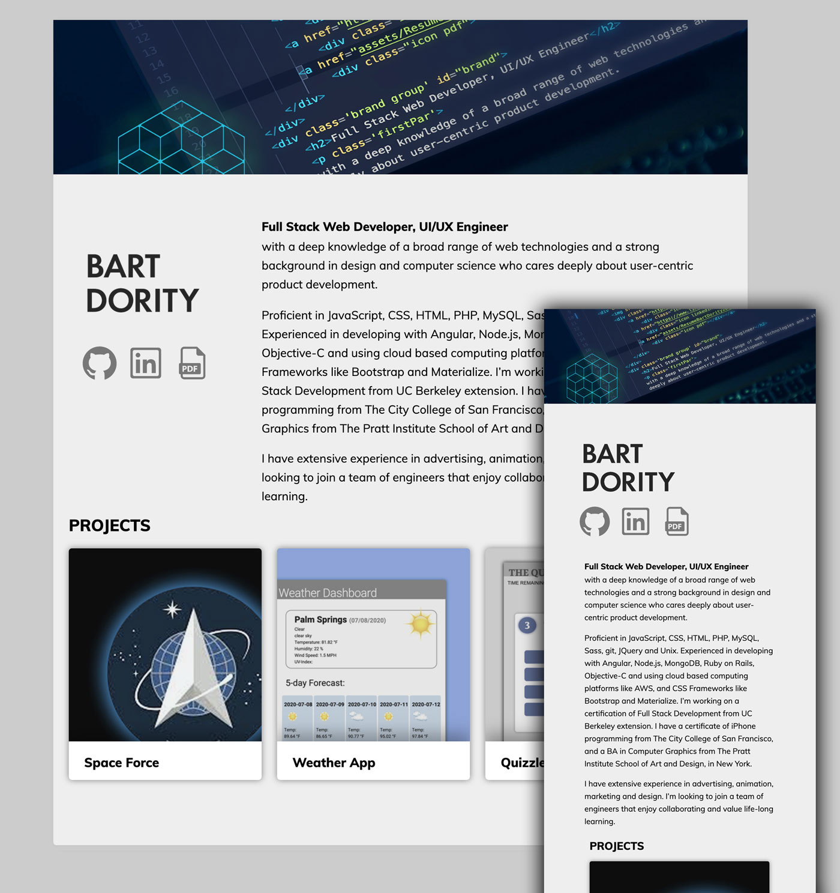

# responsive-portfolio2

<a href="https://b0rgbart3.github.io/responsive-portfolio2/">Live Demo</a>

## Bart Dority - Full Stack Developer
This is my current portfolio, which has a responsive layout, and links to some of my current projects.

## Features
1. Mobile First Design / Responsive Layout
2. Interactive Info Panels

## Technologies
1. HTML 5
2. custom CSS 3 - with Media Queries
3. custom Javascript
4. JQuery
